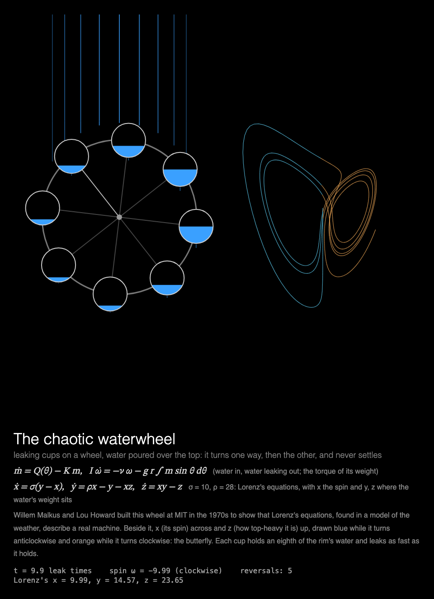

# MMM-ChaoticWaterwheel

A [MagicMirror²](https://magicmirror.builders/) module of Malkus's chaotic waterwheel: leaking cups on a wheel under a steady spray, turning one way, then the other, never settling. Its equations are Lorenz's, exactly, and beside the wheel it draws their butterfly.



## What you see

**The chaotic waterwheel.** Water sprays onto the top of a wheel whose eight cups leak. The top
gets heavy and the wheel starts to turn; the cups carry their water round, the wheel speeds up,
slows, and reverses, five to nine times a minute, never settling and never repeating. One spoke
is drawn lighter so the eye can follow the turning; under each cup a drip shows how fast it leaks.

Beside the wheel (below it, on a portrait canvas) its state is traced as it goes: its spin across
and how top-heavy it is up, Lorenz's x and z. The trace is blue while the wheel turns
anticlockwise and orange while it turns clockwise: two wings, the butterfly.

Under the picture: the wheel's equations, Lorenz's, and how they match. The readout gives the
spin, which way it is turning, how many times it has reversed, and Lorenz's x, y and z.

Built for a **Raspberry Pi 3 without GPU acceleration**: everything is drawn by the CPU, frames take turns between redrawing the wheel's box and adding the butterfly's latest stretch, so each frame changes one compact area,
and the animation stops while the module is hidden (see [Performance](#performance)).

## Installation

```bash
cd ~/MagicMirror/modules
git clone https://github.com/charleswest775/MMM-ChaoticWaterwheel
```

No npm dependencies: there is nothing to install.

## Update

```bash
cd ~/MagicMirror/modules/MMM-ChaoticWaterwheel
git pull
```

## Configuration

```js
{
	module: "MMM-ChaoticWaterwheel",
	position: "middle_center",
	config: {
		width: 900,
		height: 900,
		fps: 20
	}
},
```

The wheel starts empty each time the module is shown, and turns for as long as it is shown; a
45 s page sees it fill and reverse five to nine times.

| Option | Default | Description |
|---|---|---|
| `cycleSeconds` | `60` | Start again with an empty wheel this often; it also starts again each time the module is shown again |
| `width`, `height` | `900` | Canvas size in pixels. Portrait (height over 1.3 × width) stacks the butterfly under the wheel; otherwise they sit side by side |
| `fps` | `20` | Frame-rate cap |
| `showMath` | `true` | Equations and live numbers under the canvas |
| `turns` | `null` | Take turns with other modules on the same page, e.g. `{ of: 2, at: 1 }` (see [Taking turns](#taking-turns)) |
| `statsPanel` | `false` | A line under the math showing what the mirror spends: fps, CPU of Electron and the compositor, a bar per core, temperature. Sampled by the module's `node_helper` from `/proc`, only while the module is shown |
| `debugStats` | `false` | Show achieved fps and per-frame timings in the corner of the screen |

## Taking turns

With `turns: { of: n, at: k }`, modules on the same [MMM-pages](https://github.com/edward-shen/MMM-pages)
page each show on their own one in n showings of it: `at: 0` on the first showing and every
nth after it, `at: 1` on the second, and so on. A module that isn't on its turn takes no room on
the page and costs nothing: it hides its canvas and doesn't start. So one slot in the rotation
can hold several pages, without making the rotation longer. For example, Lorenz's equations twice, as a butterfly turning in space in [MMM-LorenzAttractor](https://github.com/charleswest775/MMM-LorenzAttractor) and as a machine:

```js
{
	module: "MMM-LorenzAttractor",
	classes: "page-chaos",
	position: "middle_center",
	config: { turns: { of: 2, at: 0 } }
},
{
	module: "MMM-ChaoticWaterwheel",
	classes: "page-chaos",
	position: "middle_center",
	config: { turns: { of: 2, at: 1 } }
},
{
	module: "MMM-pages",
	config: { modules: [["page-clock"], ["page-chaos"]], rotationTime: 45000 }
},
```

Without `turns` the module shows every time. It works just as well on a page of its own, or in
a normal region without MMM-pages, where it starts again every `cycleSeconds`.

## What's real

Willem Malkus and Lou Howard built a waterwheel like this at MIT in the 1970s, to show that
Lorenz's equations (found in a model of convection in the air) describe a real machine. The model
is the one in Steven Strogatz's *Nonlinear Dynamics and Chaos* (§9.1): water spread continuously
round the rim, with mass m(θ, t) per radian at angle θ from the bottom, poured in at Q(θ) and
leaking out at rate K·m, on a wheel of moment of inertia I with friction ν. Following each bit of
the rim as it turns,

    dm/dt = Q(θ) − K m,     I dω/dt = −ν ω − g r ∫ m sin θ dθ,     dφ/dt = ω

and the spin with the water's first harmonics (a₁, b₁ = (1/π)∫ m sin θ, m cos θ) obey Lorenz's
equations with b = 1:

    ẋ = σ(y − x),   ẏ = ρx − y − xz,   ż = xy − z
    x = −ω/K,  y = (π g r / Kν) a₁,  z = ρ + (π g r / Kν) b₁,  σ = ν / KI,  ρ = −π g r q₁ / K²ν

Here σ = 10 and ρ = 28, where the system with b = 1 is chaotic (Lyapunov exponent about 0.5 per
leak time). The rim is followed at 96 points. The spray, Q = C (1 − cos θ)⁴, peaked at the top,
has no harmonics above the fourth, and neither then does the water on the wheel (it starts
empty), so the sums over 96 points are the integrals exactly: this is the continuous wheel, not an
approximation. It is drawn as 8 cups, each holding the water of its eighth of the rim, the water
settled at the bottom of each. Integrated with RK4, a step of 0.002 leak times, shown at 0.22 leak
times a second.

The tests check that the wheel's spin and water, turned into x, y, z, follow a separate RK4
integration of Lorenz's equations to 10⁻⁶ through several reversals; that the water on the wheel
settles to what pours in over the leak rate; that with too little water (ρ < 1) the wheel comes to
rest and with enough it never does; that wheels started 10⁻⁸ apart part company after 15–60 leak
times, as Lorenz's rate says; and that no cup ever overflows.

## Performance

Not yet measured on the Pi. What it's designed to cost: the frames alternate between redrawing
the wheel's box (about a quarter of a 900² canvas; the spray above it is drawn once) and adding the butterfly's newest stretch (a
small box), so the wheel moves at 10 fps and the trace grows at 10 fps, and no frame's changes
span both. Expect something like half a core, mostly the fixed cost of 20 changed frames a second; the physics takes well under a millisecond a frame.

Why it is drawn this way, from micro-benchmarks on the Pi:

- There is no GPU acceleration to be had (the Pi 3's GPU only does GLES 2.0; Chromium needs
  3.0), so every pixel is drawn by the CPU.
- Any frame that changes the canvas costs ~2% of a core per fps, before drawing anything.
- On top of that, cost grows with the **area that changes**: Chromium redraws the bounding box
  of everything touched in a frame.
- The frame loop sleeps with `setTimeout` until a frame is due, capped at `fps`. Once the picture
  is finished the module rests, and is only polled twice a second. While MagicMirror² fades the
  module out, nothing new is drawn; once it is hidden, the loop stops.

## Development

```bash
node --test                  # the wheel's checks (no dependencies)
python3 -m http.server       # then open http://localhost:8000/dev/preview.html
```

`dev/preview.html` runs the module outside MagicMirror², in a portrait 1200×1920 frame, with
hide/show buttons that follow MagicMirror²'s suspend/resume order. Query options override the
config, e.g. `?height=1400` (portrait: the butterfly under the wheel), `?fps=30` or `?statsPanel=true`.

## License

MIT

Part of a family of MagicMirror² modules. Chaos, one simulation each:
[MMM-LorenzAttractor](https://github.com/charleswest775/MMM-LorenzAttractor),
[MMM-DoublePendulum](https://github.com/charleswest775/MMM-DoublePendulum),
[MMM-FractalBasins](https://github.com/charleswest775/MMM-FractalBasins),
[MMM-LogisticMap](https://github.com/charleswest775/MMM-LogisticMap),
[MMM-SymmetricIcons](https://github.com/charleswest775/MMM-SymmetricIcons),
[MMM-ThreeBody](https://github.com/charleswest775/MMM-ThreeBody),
[MMM-ChaoticBilliards](https://github.com/charleswest775/MMM-ChaoticBilliards),
[MMM-Rule30](https://github.com/charleswest775/MMM-Rule30),
[MMM-StandardMap](https://github.com/charleswest775/MMM-StandardMap) and
[MMM-Sandpile](https://github.com/charleswest775/MMM-Sandpile), or all eleven in
one module, [MMM-ChaosTheory](https://github.com/charleswest775/MMM-ChaosTheory).
And more pages of physics and mathematics:
[MMM-Atom](https://github.com/charleswest775/MMM-Atom),
[MMM-DoubleSlit](https://github.com/charleswest775/MMM-DoubleSlit),
[MMM-FractalZoom](https://github.com/charleswest775/MMM-FractalZoom),
[MMM-Chladni](https://github.com/charleswest775/MMM-Chladni),
[MMM-SacredGeometry](https://github.com/charleswest775/MMM-SacredGeometry),
[MMM-Tilings](https://github.com/charleswest775/MMM-Tilings),
[MMM-PlanetsDance](https://github.com/charleswest775/MMM-PlanetsDance),
[MMM-Harmonograph](https://github.com/charleswest775/MMM-Harmonograph),
[MMM-SnowCrystal](https://github.com/charleswest775/MMM-SnowCrystal) and
[MMM-NightSky](https://github.com/charleswest775/MMM-NightSky).
